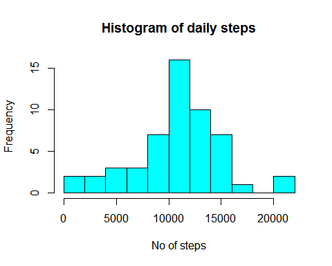
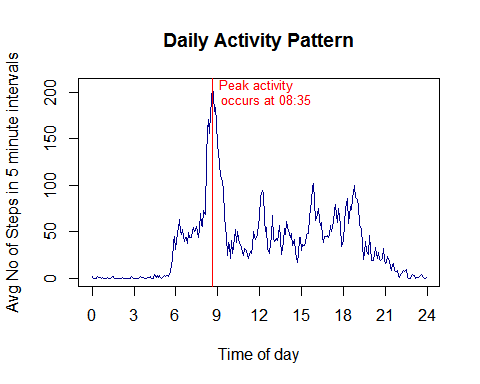
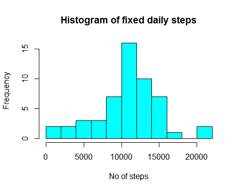
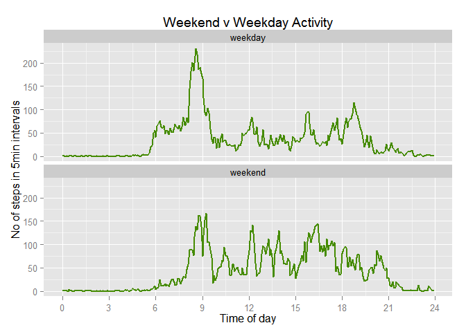

# Reproducible Research: Peer Assessment 1

This is an R markdown document that produces a "Reproducible Research" document containing the code and text 
of some data analysis of activity monitoring data.  The document is Assignment 1 of the *Coursera* course on
[*Reproducible Research*](http://www.coursera.org/course/repdata).


###Loading and preprocessing the data
This assumes the data has been saved in the Data subfolder of the current folder.  If this folder is not 
present then you will be prompted to manually choose the data file.  The data file is then loaded into 
the `data` data.frame.

1. Code to load the data:

```r
data.file <- './Data/activity.csv'

if (length(list.files(data.file))==0){
    data.file <- choose.files(filters = matrix(c("csv files (*.csv)", "All files (*.*)", "*.csv", "*.*"),2,2))
}

data <- read.csv(data.file)
```
2. No pre-processing is done at this stage

###What is (the) mean total number of steps taken per day?
This uses the data.table package to remove the NA values for the steps and group the steps taken on each day.
The mean and median are calculated from the grouped data.

1. The code and a histogram of the total number of steps taken each day is shown below:


```r
require(data.table)
```

```
## Loading required package: data.table
```

```r
data <- as.data.table(data)
data.daily <- data[!is.na(steps), .(daily_steps=sum(steps)), by=date]
#Calculate the mean and median
mean.steps <- data.daily[,mean(daily_steps)]
median.steps <- data.daily[,median(daily_steps)]

#Plot the histogram
hist(data.daily$daily_steps, breaks=10, col='cyan', main='Histogram of daily steps', xlab='No of steps')
```

 

```r
cat('mean =', mean.steps, ', median =', median.steps, '\n')
```

```
## mean = 10766.19 , median = 10765
```
2. The mean total number of steps per day is 10766.19 and median 10765.

###What is the average daily activity pattern?

1. The data is grouped the data by the interval (=time of day in 5 minute increments).
A new field is added to show the time on a 24h basis, and a plot of the mean number of 
steps against time, averaged over all the days.


```r
data.activity <- data[,.(steps=mean(steps, na.rm=TRUE)),by=interval]

#Add in a field to hold the hour from 0-24
data.activity$Time_of_day <- data.activity$interval %/% 100 + (data.activity$interval%%100) / 60 

#define a format interval function
f0<-function(x) {
    paste0(
        formatC(x %/% 100, width=2, format='d', flag='0')
        ,':'
        ,formatC(x %% 100, width=2, format='d', flag='0')
    )
}

#Which interval contains the most steps on average
most.steps <- data.activity[which.max(steps)]
most.steps.label <- paste0('Peak activity\noccurs at ', f0(most.steps$interval))

#plot the steps ~ Time of Day
plot(steps~Time_of_day, data=data.activity, type='l'
     ,main='Daily Activity Pattern'
     ,xlab='Time of day'
     ,ylab='Avg No of Steps in 5 minute intervals'
     ,col='darkblue'
     ,xaxt='no')
axis(1, at=c(0,3,6,9,12,15,18,21,24))
abline(v=most.steps$Time_of_day, col='red')
text(most.steps$Time_of_day, most.steps$steps, most.steps.label, cex=.8, adj=c(-.1,0.7), col="red")
```

 

2. The 5 minute interval containing the maximum average number of steps is 08:35

###Imputing missing values

1. Calculate the total number of rows in the data with NA in any field:

```r
missing.data.count <- sum(apply(is.na(data),1,any))
```
There are 2304 rows with NA in one or more data fields (out of 17568 rows)

2. The strategy to fill a missing value is to fill it with the mean value for that interval from the days 
that dont have values missing.  This has already been calculated above in `data.activity`.

3. Create a new data set equal to the original in variable `data.fixed` and fill in the missing values:

```r
#create a fixed version of the data table
data.fixed <- data

#define a key for the data.activity table
setkey(data.activity, interval)

#rows with missing step info (as a vector of index positions)
missing.steps <- which(is.na(data.fixed$steps))

#list of intervale that we need to extract
missing.intervals <- data.fixed[missing.steps, interval] 

#populate the fixed data from the same interval in the average steps 
data.fixed$steps[missing.steps] <- data.activity[.(missing.intervals), steps]
```

4. Make a new histogram and calculate and report the new mean and median:

```r
#prepare histogram info
data.fixed.daily <- data.fixed[, .(daily_steps=sum(steps)), by=date]

#Calculate the mean and median
mean.fixed.steps <- data.fixed.daily[,mean(daily_steps)]
median.fixed.steps <- data.fixed.daily[,median(daily_steps)]

#Plot the histogram
hist(data.daily$daily_steps, breaks=10, col='cyan', main='Histogram of fixed daily steps', xlab='No of steps')
```

 

```r
cat('mean =', mean.fixed.steps, ', median =', median.fixed.steps, '\n')
```

```
## mean = 10766.19 , median = 10766.19
```

The fixed data now has a mean = *10766.19* 
and a median = *10766.19*.  Although the mean is unchanged, adding a whole lot 
of values exactly equal to the mean has made the median one of these artificial values.

Imputing data equal to the mean has not changed the mean daily number of steps although it has increased
the total number of steps over the whole period from 570608 to 
656737.5

###Are there differences in activity patterns between weekdays and weekends?
1. Create a mapping from the named day of the week to weekday/weekend and use this to add a new 
factor variable to the `data.fixed` data set.


```r
daytype <- c('Monday'='weekday'
           ,'Tuesday'='weekday'
           ,'Wednesday'='weekday'
           ,'Thursday'='weekday'
           ,'Friday'='weekday'
           ,'Saturday'='weekend'
           ,'Sunday'='weekend')
#add in the additional field
data.fixed$day <- as.factor(daytype[weekdays(as.Date(data.fixed$date))])
```

2. The code below uses the ggplot2 package to make a panel plot of typical weekday and typical
weekend activity.


```r
#use ggplot2 graphics system
require(ggplot2)
```

```
## Loading required package: ggplot2
```

```
## Warning: package 'ggplot2' was built under R version 3.1.2
```

```r
#summarise the data by day and interval
data.fixed.day<-data.fixed[,.(steps=mean(steps)), by=.(day, interval)]
#Add in a field to hold the hour from 0-24
data.fixed.day$Time_of_day <- data.fixed.day$interval %/% 100 + (data.fixed.day$interval%%100) / 60 

ggplot(data=data.fixed.day, aes(y=steps, x=Time_of_day)) + 
    geom_line(colour='chartreuse4', size=1) +
    scale_x_continuous(breaks=c(0,3,6,9,12,15,18,21,24)) +
    facet_wrap(~day, ncol=1) +
    labs(title = 'Weekend v Weekday Activity'
         ,x = 'Time of day'
         ,y = 'No of steps in 5min intervals')
```

 
